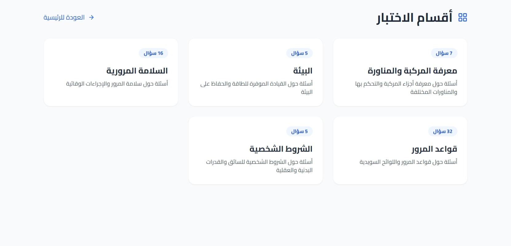

# 🇸🇪 Swedish Driving Theory Platform
> A full-stack educational system designed to master the Swedish driving license theory test.

---

## 📸 Interface Preview
| Dashboard Overview | Practice Categories | Examination Mode |
| :---: | :---: | :---: |
|  |  |  |

---

## 🚀 Tech Stack

### Backend (Django 5.0)
* **Framework**: Django 5.0 with Django REST Framework (DRF).
***Database**: PostgreSQL support via `psycopg2-binary`.
* **Environment**: Secure configuration using `python-decouple`.
* **CORS**: Configured with `django-cors-headers` for frontend communication.

### Frontend (React + Vite)
* **Framework**: React.js powered by **Vite** for optimized performance.
* **Styling**: Tailwind CSS for a responsive and modern UI.
* **State Management**: React Context API via `TestContext.js`.
* **I18n**: Built-in multi-language configuration.

---

## 📂 Project Architecture

### Backend Structure
```bash
backend/
├── api/                 # Serializers, Views, and Models 
├── config/              # Django Settings and URLs 
├── data/                # Question bank (JSON format) 
├── import_questions.py  # Script for data migration 
└── requirements.txt     # Backend dependencies

Frontend Structure
Bash

frontend/
├── src/
│   ├── components/      # LoadingSpinner, Timer, ProgressBar, QuestionCard 
│   ├── pages/           # HomePage, SectionsPage, TestPage, ResultsPage 
│   ├── contexts/        # Global State Management 
│   └── services/        # API integration (api.js) 
└── tailwind.config.js    # Design system configuration 
🛠 Installation & Setup
1. Backend Setup
Bash

# Activate virtual environment 
conda create -n swedish_env python=3.10 -y
conda activate swedish_env

# Install dependencies 
cd backend
pip install -r requirements.txt

# Migrate and Run
python manage.py migrate
python import_questions.py
python manage.py runserver
2. Frontend Setup
Bash

cd frontend
npm install
npm run dev
✨ Core Features

Automated Question Import: Populate the database instantly using the import_questions.py script.


Real-time Tracking: Integrated Timer.jsx and ProgressBar.jsx for a realistic exam experience.


Dynamic Content: Fetching category-specific questions through a structured API.


I18n Support: Multi-language interface for diverse users.

🔑 Environment Variables
Create a .env file in the backend directory:

SECRET_KEY: Your Django secret key.

DEBUG: Set to True for development.

DATABASE_URL: Connection string for PostgreSQL.

🤝 Contributors
Lead Architect: ayakakaa135-boop
